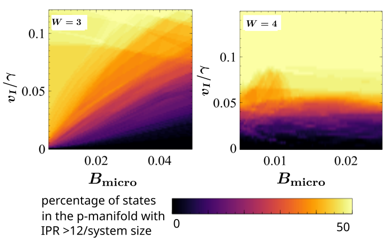

# Superlattice AAH — Non-Hermitian grid (B×v) in reference to the figure 10 (a,c) in the paper **Topology and criticality in non-Hermitian multimodal optical resonators through engineered losses arXiv:2509.05163**

Sweeps a $(B, v)$ grid for a **non-Hermitian** superlattice tight-binding model for islands of sizes $W$ as $3$ and $4$:
- Builds a superlattice/multimodal chain as in the paper arXiv:2509.05163 
- Peierls phases on hops (gauge retained),
- Imaginary onsite AAH potential (gain/loss) giving rise to a non-Hermitian system,
- Solved with `eig(left=True,right=True)`; metric uses **biorthogonal** IPR.

Uses parallelization of the program on an HPC cluster using slurm and the output is saved in results/imag_even_parallel_array_ALL_{job_id}.dat as B,v,percentage in rows

The output file looks like <p align="center">
  
  <br><em>Figure 1</em>
</p>


## Run locally
```bash
pip install -r requirements.txt
sbatch slurm/job_array.ssh

